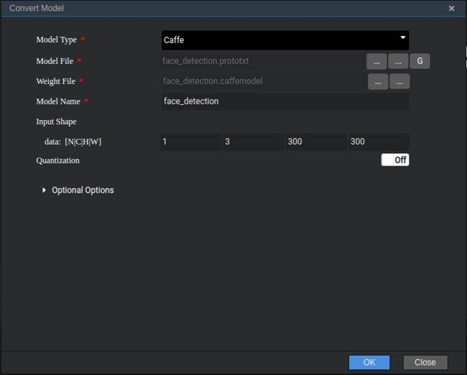

中文|[英文](README.md)

# 人脸检测<a name="ZH-CN_TOPIC_0185834679"></a>

开发者可以将本application部署至Atlas 200DK上实现对摄像头数据的实时采集、并对视频中的人脸信息进行预测的功能。

## 前提条件<a name="zh-cn_topic_0182554577_section137245294533"></a>

部署此Sample前，需要准备好以下环境：

-   已完成Mind Studio的安装。
-   已完成Atlas 200 DK开发者板与Mind Studio的连接，交叉编译器的安装，SD卡的制作及基本信息的配置等。

## 软件准备<a name="zh-cn_topic_0182554577_section081240125311"></a>

运行此Sample前，需要按照此章节获取源码包，并进行相关的环境配置。

1.  <a name="zh-cn_topic_0182554577_li953280133816"></a>获取源码包。

    将[https://github.com/Ascend/sample-facedetection](https://github.com/Ascend/sample-facedetection)仓中的代码以Mind Studio安装用户下载至Mind Studio所在Ubuntu服务器的任意目录，例如代码存放路径为：_/home/ascend/sample-facedetection_。

2.  <a name="zh-cn_topic_0182554577_li1365682471610"></a>获取此应用中所需要的原始网络模型。

    参考[表1](#zh-cn_topic_0182554577_table144841813177)获取此应用中所用到的原始网络模型及其对应的权重文件，并将其存放到Mind Studio所在Ubuntu服务器的任意目录，例如$HOME/ascend/models/facedetection。

    **表 1**  Face Detection中使用模型

    <a name="zh-cn_topic_0182554577_table144841813177"></a>
    <table><thead align="left"><tr id="zh-cn_topic_0182554577_row161061318181712"><th class="cellrowborder" valign="top" width="13.61%" id="mcps1.2.4.1.1"><p id="zh-cn_topic_0182554577_p1410671814173"><a name="zh-cn_topic_0182554577_p1410671814173"></a><a name="zh-cn_topic_0182554577_p1410671814173"></a>模型名称</p>
    </th>
    <th class="cellrowborder" valign="top" width="10.03%" id="mcps1.2.4.1.2"><p id="zh-cn_topic_0182554577_p1106118121716"><a name="zh-cn_topic_0182554577_p1106118121716"></a><a name="zh-cn_topic_0182554577_p1106118121716"></a>模型说明</p>
    </th>
    <th class="cellrowborder" valign="top" width="76.36%" id="mcps1.2.4.1.3"><p id="zh-cn_topic_0182554577_p14106218121710"><a name="zh-cn_topic_0182554577_p14106218121710"></a><a name="zh-cn_topic_0182554577_p14106218121710"></a>模型下载路径</p>
    </th>
    </tr>
    </thead>
    <tbody><tr id="zh-cn_topic_0182554577_row1710661814171"><td class="cellrowborder" valign="top" width="13.61%" headers="mcps1.2.4.1.1 "><p id="zh-cn_topic_0182554577_p13106121801715"><a name="zh-cn_topic_0182554577_p13106121801715"></a><a name="zh-cn_topic_0182554577_p13106121801715"></a>face_detection</p>
    </td>
    <td class="cellrowborder" valign="top" width="10.03%" headers="mcps1.2.4.1.2 "><p id="zh-cn_topic_0182554577_p13106171831710"><a name="zh-cn_topic_0182554577_p13106171831710"></a><a name="zh-cn_topic_0182554577_p13106171831710"></a>人脸检测网络模型。</p>
    <p id="zh-cn_topic_0182554577_p18106718131714"><a name="zh-cn_topic_0182554577_p18106718131714"></a><a name="zh-cn_topic_0182554577_p18106718131714"></a>此模型是基于Caffe的Resnet10-SSD300模型转换后的网络模型。</p>
    </td>
    <td class="cellrowborder" valign="top" width="76.36%" headers="mcps1.2.4.1.3 "><p id="zh-cn_topic_0182554577_p110671813170"><a name="zh-cn_topic_0182554577_p110671813170"></a><a name="zh-cn_topic_0182554577_p110671813170"></a>请参考<a href="https://github.com/Ascend/models/tree/master/computer_vision/object_detect/face_detection" target="_blank" rel="noopener noreferrer">https://github.com/Ascend/models/tree/master/computer_vision/object_detect/face_detection</a>目录中README.md下载原始网络模型文件及其对应的权重文件。</p>
    </td>
    </tr>
    </tbody>
    </table>

3.  将原始网络模型转换为Davinci模型。
    1.  在Mind Studio操作界面的顶部菜单栏中选择“Tool \> Convert Model”，进入模型转换界面。
    2.  在弹出的**Convert Model**操作界面中，Model File与Weight File分别选择[2](#zh-cn_topic_0182554577_li1365682471610)中下载的模型文件和权重文件。

        如[图1](#zh-cn_topic_0182554577_fig1954118512311)所示：

        -   Model Name填写为[表1](#zh-cn_topic_0182554577_table144841813177)中的模型名称：**face\_detection**。
        -   其他参数保持默认值。

        **图 1**  face\_detection模型转换配置<a name="zh-cn_topic_0182554577_fig1954118512311"></a>  
        

    3.  单击“OK“开始模型转换。

        转换时，会出现如下报错信息。

        **图 2**  模型转换错误<a name="zh-cn_topic_0182554577_fig1632884495219"></a>  
        

        此时在DetectionOutput层的Suggestion中选择**SSDDetectionOutput**，并点击**Retry**。

        模型转换成功后，转换好的后缀为.om的模型文件存放地址为：$HOME/tools/che/model-zoo/my-model/face\_detection。

        如下图所示。

        **图 3**  模型转换成功<a name="zh-cn_topic_0182554577_fig19292258105419"></a>  
        


4.  将转换好的模型文件（.om文件）上传到[1](#zh-cn_topic_0182554577_li953280133816)中源码所在路径下的“sample-facedetection/script”目录下。
5.  以Mind Studio安装用户登录Mind Studio所在Ubuntu服务器，并设置环境变量DDK\_HOME。

    **vim \~/.bashrc**

    执行如下命令在最后一行添加DDK\_HOME及LD\_LIBRARY\_PATH的环境变量。

    **export DDK\_HOME=/home/XXX/tools/che/ddk/ddk**

    **export LD\_LIBRARY\_PATH=$DDK\_HOME/uihost/lib**

    > **说明：**   
    >-   XXX为Mind Studio安装用户，/home/XXX/tools为DDK默认安装路径。  
    >-   如果此环境变量已经添加，则此步骤可跳过。  

    输入:wq!保存退出。

    执行如下命令使环境变量生效。

    **source \~/.bashrc**


## 部署<a name="zh-cn_topic_0182554577_section7994174585917"></a>

1.  以Mind Studio安装用户进入facedetectionapp应用代码所在根目录，如/home/ascend/sample-facedetection。
2.  <a name="zh-cn_topic_0182554577_li9634105881418"></a>执行部署脚本，进行工程环境准备，包括ascenddk公共库的编译与部署、Presenter Server服务器的配置等操作，其中Presenter Server用于接收Application发送过来的数据并通过浏览器进行结果展示。

    **bash deploy.sh** _host\_ip_ _model\_mode_

    -   _host\_ip_：Atlas 200 DK开发者板的IP地址。
    -   model\_mode代表模型文件及依赖软件的部署方式，默认为internet。
        -   local：若Mind Studio所在Ubuntu系统未连接网络，请使用local模式，执行此命令前，需要参考[公共代码库下载](#zh-cn_topic_0182554577_section4995103618210)将依赖的公共代码库下载到“sample-facedetection/script“目录下。
        -   internet：若Mind Studio所在Ubuntu系统已连接网络，请使用internet模式，在线下载依赖代码库。


    命令示例：

    **bash deploy.sh 192.168.1.2 internet**

    当提示“Please choose one to show the presenter in browser\(default: 127.0.0.1\):“时，请输入在浏览器中访问Presenter Server服务所使用的IP地址（一般为访问Mind Studio的IP地址。）

    如[图4](#zh-cn_topic_0182554577_fig184321447181017)所示，请在“Current environment valid ip list“中选择通过浏览器访问Presenter Server服务使用的IP地址。

    **图 4**  工程部署示意图<a name="zh-cn_topic_0182554577_fig184321447181017"></a>  
    

3.  <a name="zh-cn_topic_0182554577_li499911453439"></a>启动Presenter Server。

    执行如下命令在后台启动Face Detection应用的Presenter Server主程序。

    **python3 presenterserver/presenter\_server.py --app face\_detection &**

    > **说明：**   
    >“presenter\_server.py“在当前目录的“presenterserver“目录下，可以在此目录下执行**python3 presenter\_server.py -h**或者**python3 presenter\_server.py --help**查看“presenter\_server.py“的使用方法。  

    如[图5](#zh-cn_topic_0182554577_fig69531305324)所示，表示presenter\_server的服务启动成功。

    **图 5**  Presenter Server进程启动<a name="zh-cn_topic_0182554577_fig69531305324"></a>  
    

    使用上图提示的URL登录Presenter Server，仅支持Chrome浏览器。IP地址为[2](#zh-cn_topic_0182554577_li9634105881418)中输入的IP地址，端口号默为7007，如下图所示，表示Presenter Server启动成功。

    **图 6**  主页显示<a name="zh-cn_topic_0182554577_fig64391558352"></a>  
    

    Presenter Server、Mind Studio与Atlas 200 DK之间通信使用的IP地址示例如下图所示：

    **图 7**  IP地址示例<a name="zh-cn_topic_0182554577_fig1881532172010"></a>  
    

    其中：

    -   Atlas 200 DK开发者板使用的IP地址为192.168.1.2（USB方式连接）。
    -   Presenter Server与Atlas 200 DK通信的IP地址为UI Host服务器中与Atlas 200 DK在同一网段的IP地址，例如：192.168.1.223。
    -   通过浏览器访问Presenter Server的IP地址本示例为：10.10.0.1，由于Presenter Server与Mind Studio部署在同一服务器，此IP地址也为通过浏览器访问Mind Studio的IP。


## 运行<a name="zh-cn_topic_0182554577_section551710297235"></a>

1.  运行Face Detection程序。

    在**sample-facedetection**目录下执行如下命令运行Face Detection应用程序。

    **bash run\_facedetectionapp.sh** _host\_ip_ _presenter\_view\_app\_name  camera\_channel\_name_   &

    -   _host\_ip_：对于Atlas 200 DK开发者板，即为开发者板的IP地址。
    -   _presenter\_view\_app\_name_：用户自定义的在PresenterServer界面展示的View Name，此View Name需要在Presenter Server展示界面唯一，只能是大小写字母、数字、“_”的组合，位数3-20。
    -   _camera\_channel\_name_：摄像头所属Channel，取值为“Channel-1“或者“Channel-2“，查询摄像头所属Channel的方法请参考[Atlas 200 DK使用指南](https://ascend.huawei.com/documentation)中的“如何查看摄像头所属Channel”。

    命令示例：

    **bash run\_facedetectionapp.sh 192.168.1.2 video Channel-1 &**

2.  使用启动Presenter Server服务时提示的URL登录 Presenter Server 网站，详细可参考[3](#zh-cn_topic_0182554577_li499911453439)。

    等待Presenter Agent传输数据给服务端，单击“Refresh“刷新，当有数据时相应的Channel 的Status变成绿色，如[图8](#zh-cn_topic_0182554577_fig113691556202312)所示。

    **图 8**  Presenter Server界面<a name="zh-cn_topic_0182554577_fig113691556202312"></a>  
    

    > **说明：**   
    >-   Face Detection的Presenter Server最多支持10路Channel同时显示，每个  _presenter\_view\_app\_name_  对应一路Channel。  
    >-   由于硬件的限制，每一路支持的最大帧率是20fps，受限于网络带宽的影响，帧率会自动适配为较低的帧率进行展示。  

3.  单击右侧对应的View Name链接，比如上图的“video”，查看结果，对于检测到的人脸，会给出置信度的标注。

## 后续处理<a name="zh-cn_topic_0182554577_section177619345260"></a>

-   **停止Face Detection应用**

    Face Detection应用执行后会处于持续运行状态，若要停止Face Detection应用程序，可执行如下操作。

    以Mind Studio安装用户在_** /home/ascend/sample-facedetection**_  目录下执行如下命令：

    **bash stop\_facedetectionapp.sh** _host\_ip_

    _host\_ip_：对于Atlas 200 DK开发者板，即为开发者板的IP地址。。

    命令示例：

    **bash stop\_facedetectionapp.sh 192.168.1.2**

-   **停止Presenter Server服务**

    Presenter Server服务启动后会一直处于运行状态，若想停止Face Detection应用对应的Presenter Server服务，可执行如下操作。

    以Mind Studio安装用户在Mind Studio所在服务器中执行如下命令查看Face Detection应用对应的Presenter Server服务的进程。

    **ps -ef | grep presenter | grep face\_detection**

    ```
    ascend@ascend-HP-ProDesk-600-G4-PCI-MT:~/sample-facedetection$ ps -ef | grep presenter | grep face_detection
    ascend    7701  1615  0 14:21 pts/8    00:00:00 python3 presenterserver/presenter_server.py --app face_detection
    ```

    如上所示  _7701_  即为face\_detection应用对应的Presenter Server服务的进程ID。

    若想停止此服务，执行如下命令：

    **kill -9** _7701_


## 公共代码库下载<a name="zh-cn_topic_0182554577_section4995103618210"></a>

将依赖的软件库下载到“sample-facedetection/script“目录下。

**表 2**  依赖代码库下载

<a name="zh-cn_topic_0182554577_table9491163455810"></a>
<table><thead align="left"><tr id="zh-cn_topic_0182554577_row1949214345587"><th class="cellrowborder" valign="top" width="33.33333333333333%" id="mcps1.2.4.1.1"><p id="zh-cn_topic_0182554577_p164921034205816"><a name="zh-cn_topic_0182554577_p164921034205816"></a><a name="zh-cn_topic_0182554577_p164921034205816"></a>模块名称</p>
</th>
<th class="cellrowborder" valign="top" width="33.33333333333333%" id="mcps1.2.4.1.2"><p id="zh-cn_topic_0182554577_p7493173475818"><a name="zh-cn_topic_0182554577_p7493173475818"></a><a name="zh-cn_topic_0182554577_p7493173475818"></a>模块描述</p>
</th>
<th class="cellrowborder" valign="top" width="33.33333333333333%" id="mcps1.2.4.1.3"><p id="zh-cn_topic_0182554577_p18493133420580"><a name="zh-cn_topic_0182554577_p18493133420580"></a><a name="zh-cn_topic_0182554577_p18493133420580"></a>下载地址</p>
</th>
</tr>
</thead>
<tbody><tr id="zh-cn_topic_0182554577_row449315344589"><td class="cellrowborder" valign="top" width="33.33333333333333%" headers="mcps1.2.4.1.1 "><p id="zh-cn_topic_0182554577_p144931334165819"><a name="zh-cn_topic_0182554577_p144931334165819"></a><a name="zh-cn_topic_0182554577_p144931334165819"></a>EZDVPP</p>
</td>
<td class="cellrowborder" valign="top" width="33.33333333333333%" headers="mcps1.2.4.1.2 "><p id="zh-cn_topic_0182554577_p349393413588"><a name="zh-cn_topic_0182554577_p349393413588"></a><a name="zh-cn_topic_0182554577_p349393413588"></a>对DVPP接口进行了封装，提供对图片/视频的处理能力。</p>
</td>
<td class="cellrowborder" valign="top" width="33.33333333333333%" headers="mcps1.2.4.1.3 "><p id="zh-cn_topic_0182554577_p1949313416583"><a name="zh-cn_topic_0182554577_p1949313416583"></a><a name="zh-cn_topic_0182554577_p1949313416583"></a><a href="https://github.com/Ascend/sdk-ezdvpp" target="_blank" rel="noopener noreferrer">https://github.com/Ascend/sdk-ezdvpp</a></p>
<p id="zh-cn_topic_0182554577_p74931134115816"><a name="zh-cn_topic_0182554577_p74931134115816"></a><a name="zh-cn_topic_0182554577_p74931134115816"></a>下载后请保持文件夹名称为ezdvpp。</p>
</td>
</tr>
<tr id="zh-cn_topic_0182554577_row134936341585"><td class="cellrowborder" valign="top" width="33.33333333333333%" headers="mcps1.2.4.1.1 "><p id="zh-cn_topic_0182554577_p194932344585"><a name="zh-cn_topic_0182554577_p194932344585"></a><a name="zh-cn_topic_0182554577_p194932344585"></a>Presenter Agent</p>
</td>
<td class="cellrowborder" valign="top" width="33.33333333333333%" headers="mcps1.2.4.1.2 "><p id="zh-cn_topic_0182554577_p5493634115811"><a name="zh-cn_topic_0182554577_p5493634115811"></a><a name="zh-cn_topic_0182554577_p5493634115811"></a>与Presenter Server进行交互的API接口。</p>
</td>
<td class="cellrowborder" valign="top" width="33.33333333333333%" headers="mcps1.2.4.1.3 "><p id="zh-cn_topic_0182554577_p1949416349581"><a name="zh-cn_topic_0182554577_p1949416349581"></a><a name="zh-cn_topic_0182554577_p1949416349581"></a><a href="https://github.com/Ascend/sdk-presenter/tree/master" target="_blank" rel="noopener noreferrer">https://github.com/Ascend/sdk-presenter/tree/master</a></p>
<p id="zh-cn_topic_0182554577_p124947348588"><a name="zh-cn_topic_0182554577_p124947348588"></a><a name="zh-cn_topic_0182554577_p124947348588"></a>请获取此路径下的presenteragent文件夹，下载后请保持文件夹名称为presenteragent。</p>
</td>
</tr>
<tr id="zh-cn_topic_0182554577_row2049413455810"><td class="cellrowborder" valign="top" width="33.33333333333333%" headers="mcps1.2.4.1.1 "><p id="zh-cn_topic_0182554577_p15494183414589"><a name="zh-cn_topic_0182554577_p15494183414589"></a><a name="zh-cn_topic_0182554577_p15494183414589"></a>tornado (5.1.0)</p>
<p id="zh-cn_topic_0182554577_p04941634185812"><a name="zh-cn_topic_0182554577_p04941634185812"></a><a name="zh-cn_topic_0182554577_p04941634185812"></a>protobuf (3.5.1)</p>
<p id="zh-cn_topic_0182554577_p2049418342580"><a name="zh-cn_topic_0182554577_p2049418342580"></a><a name="zh-cn_topic_0182554577_p2049418342580"></a>numpy (1.14.2)</p>
</td>
<td class="cellrowborder" valign="top" width="33.33333333333333%" headers="mcps1.2.4.1.2 "><p id="zh-cn_topic_0182554577_p24941634175814"><a name="zh-cn_topic_0182554577_p24941634175814"></a><a name="zh-cn_topic_0182554577_p24941634175814"></a>Presenter Server依赖的Python库</p>
</td>
<td class="cellrowborder" valign="top" width="33.33333333333333%" headers="mcps1.2.4.1.3 "><p id="zh-cn_topic_0182554577_p1349493405810"><a name="zh-cn_topic_0182554577_p1349493405810"></a><a name="zh-cn_topic_0182554577_p1349493405810"></a>可以在python官网<a href="https://pypi.org/" target="_blank" rel="noopener noreferrer">https://pypi.org/</a>上搜索相关包进行安装。</p>
<p id="zh-cn_topic_0182554577_p84941034135812"><a name="zh-cn_topic_0182554577_p84941034135812"></a><a name="zh-cn_topic_0182554577_p84941034135812"></a>若使用pip3 install命令在线下载，可以使用如下命令指定相关版本进行下载，例如：</p>
<p id="zh-cn_topic_0182554577_p3494734185814"><a name="zh-cn_topic_0182554577_p3494734185814"></a><a name="zh-cn_topic_0182554577_p3494734185814"></a>pip3 install tornado==5.1.0  -i  <em id="zh-cn_topic_0182554577_i12494113495819"><a name="zh-cn_topic_0182554577_i12494113495819"></a><a name="zh-cn_topic_0182554577_i12494113495819"></a>指定库的安装源</em>  --trusted-host  <em id="zh-cn_topic_0182554577_i8494153413586"><a name="zh-cn_topic_0182554577_i8494153413586"></a><a name="zh-cn_topic_0182554577_i8494153413586"></a>安装源的主机名</em></p>
</td>
</tr>
</tbody>
</table>
