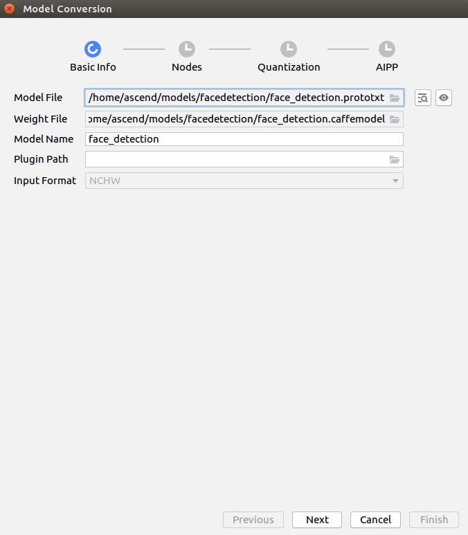
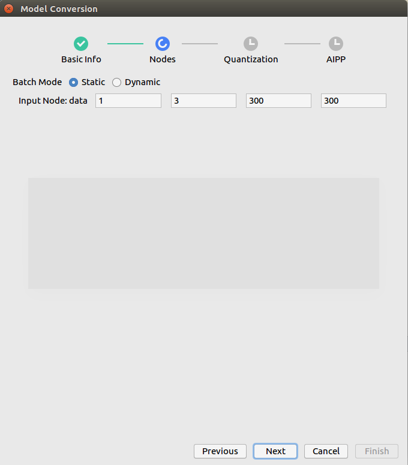

EN|[CN](Readme.md)

# Face Detection<a name="ZH-CN_TOPIC_0208834076"></a>

Developers can deploy the application on the Atlas 200 DK to collect camera data in real time and predict facial information in the video.

Application in the current branch is adapted to [DDK&RunTime](https://ascend.huawei.com/resources) with **1.31.0.0 and the above** version 

## Prerequisites<a name="zh-cn_topic_0203223294_section137245294533"></a>

Before using an open source application, ensure that:

-   **Mind Studio**  has been installed.
-   The Atlas 200 DK developer board has been connected to  **Mind Studio**, the cross compiler has been installed, the SD card has been prepared, and basic information has been configured.

## Software Preparation<a name="zh-cn_topic_0203223294_section081240125311"></a>

Before running the application, obtain the source code package and configure the environment as follows.

1.  <a name="zh-cn_topic_0203223294_li953280133816"></a>Obtain the source code package.

    Download all the code in the sample-facedetection repository at  [https://github.com/Atlas200DKTest/sample-facedetection/tree/1.3x.0.0/](https://github.com/Atlas200DKTest/sample-facedetection/tree/1.3x.0.0/) to any directory on Ubuntu Server where  Mind Studio  is located as the  Mind Studio  installation user, for example,  **$HOME/AscendProjects/sample-facedetection**.

2.  <a name="zh-cn_topic_0203223294_li1365682471610"></a>Obtain the source network model required by the application.

    Obtain the source network model and its weight file used in the application by referring to  [Table 1](#zh-cn_topic_0203223294_table144841813177), and save them to any directory on the Ubuntu server where  Mind Studio  is located (for example, **$HOME/models/facedetection**).

    **表 1**  Models used for Face Detection

    <a name="zh-cn_topic_0203223294_table144841813177"></a>
    <table><thead align="left"><tr id="zh-cn_topic_0203223294_row161061318181712"><th class="cellrowborder" valign="top" width="13.61%" id="mcps1.2.4.1.1"><p id="zh-cn_topic_0203223294_p1410671814173"><a name="zh-cn_topic_0203223294_p1410671814173"></a><a name="zh-cn_topic_0203223294_p1410671814173"></a>Model Name</p>
    </th>
    <th class="cellrowborder" valign="top" width="10.03%" id="mcps1.2.4.1.2"><p id="zh-cn_topic_0203223294_p1106118121716"><a name="zh-cn_topic_0203223294_p1106118121716"></a><a name="zh-cn_topic_0203223294_p1106118121716"></a>Model Description</p>
    </th>
    <th class="cellrowborder" valign="top" width="76.36%" id="mcps1.2.4.1.3"><p id="zh-cn_topic_0203223294_p14106218121710"><a name="zh-cn_topic_0203223294_p14106218121710"></a><a name="zh-cn_topic_0203223294_p14106218121710"></a>Model Download Path</p>
    </th>
    </tr>
    </thead>
    <tbody><tr id="zh-cn_topic_0203223294_row1710661814171"><td class="cellrowborder" valign="top" width="13.61%" headers="mcps1.2.4.1.1 "><p id="zh-cn_topic_0203223294_p13106121801715"><a name="zh-cn_topic_0203223294_p13106121801715"></a><a name="zh-cn_topic_0203223294_p13106121801715"></a>face_detection</p>
    </td>
    <td class="cellrowborder" valign="top" width="10.03%" headers="mcps1.2.4.1.2 "><p id="zh-cn_topic_0203223294_p13106171831710"><a name="zh-cn_topic_0203223294_p13106171831710"></a><a name="zh-cn_topic_0203223294_p13106171831710"></a>Network model for face detection.</p>
    <p id="zh-cn_topic_0203223294_p18106718131714"><a name="zh-cn_topic_0203223294_p18106718131714"></a><a name="zh-cn_topic_0203223294_p18106718131714"></a>It is a network model converted from ResNet10-SSD300 model based on Caffe.</p>
    </td>
    <td class="cellrowborder" valign="top" width="76.36%" headers="mcps1.2.4.1.3 "><p id="zh-cn_topic_0203223294_p110671813170"><a name="zh-cn_topic_0203223294_p110671813170"></a><a name="zh-cn_topic_0203223294_p110671813170"></a>Download the source network model file and its weight file by referring to<strong id="en-us_topic_0182554577_b10408165011127"><a name="en-us_topic_0182554577_b10408165011127"></a><a name="en-us_topic_0182554577_b10408165011127"></a> README.md</strong> in <a href="https://github.com/HuaweiAscendTest/models/tree/master/computer_vision/object_detect/face_detection" target="_blank" rel="noopener noreferrer">https://github.com/HuaweiAscendTest/models/tree/master/computer_vision/object_detect/face_detection</a>.</p>
    </td>
    </tr>
    </tbody>
    </table>

3.  Log in to Ubuntu Server where Mind Studio is located as the Mind Studio installation user, confirm current DDK version and set the  environment variable  **DDK\_HOME**, **tools\_version**, **NPU\_DEVICE\_LIB** and **LD\_LIBRARY\_PATH**.

    1.  <a name="zh-cn_topic_0203223294_li61417158198"></a>Find current DDK version number.

        Current DDK version number can be obtained by either Mind studio tool or DDK packages.

        -   Using Mind studio tool.

            choose **File \> Settings \> System Settings \> Ascend DDK** from the main menu of **Mind Studio**, DDK version inquiry page will display as [Figure 1](zh-cn_topic_0203223294.md#fig94023140222).

            **Figure 1** DDK version inquiry page<a name="zh-cn_topic_0203223294_fig17553193319118"></a>  
            

            **DDK Version** shows in this page is current DDK version, for example, **1.31.T15.B150**.
            
        -   Using DDK package

            Obtain DDK version by installed DDK package name.
            
            The format of DDK package name is: **Ascend\_DDK-\{software version}-\{interface version}-x86\_64.ubuntu16.04.tar.gz**
             
             Where **software version** represents the DDK version.
             
             For example:
             
             If the name of DDK package is **Ascend\_DDK-1.31.T15.B150-1.1.1-x86\_64.ubuntu16.04.tar.gz**, the DDK version would be **1.31.T15.B150**.

    2.  Set the environment variable.
        

        **vim \~/.bashrc**

        Run the following commands to add the environment variables  **DDK\_HOME**  and  **LD\_LIBRARY\_PATH**  to the last line:

        **export tools\_version=_1.31.X.X_**

        **export DDK\_HOME=\\$HOME/.mindstudio/huawei/ddk/\\$tools\_version/ddk**

        **export NPU\_DEVICE\_LIB=$DDK\_HOME/../RC/host-aarch64\_Ubuntu16.04.3/lib**

        **export LD\_LIBRARY\_PATH=$DDK\_HOME/lib/x86\_64-linux-gcc5.4**

        > **NOTE：**   
        >-   **_1.31.X.X_** is the DDK version obtained from [Figure 1](#zh-cn_topic_0203223294_li61417158198), it needs be filled according to the inquiry result，for example, **1.31.T15.B150**  
        
        >-   If the environment variables have been added, this step can be skipped.

        Enter  **:wq!**  to save and exit.

        Run the following command for the environment variable to take effect:

        **source \~/.bashrc**

4.  Convert the source network to a model supported by Ascend AI processor. There are two ways for model conversion:  **Mind Studio** tool conversion and command line conversion.

    -   Model conversion using **Mind Studio** tool
    
        1.  Choose **Tool \> Convert** Model from the main menu of Mind Studio. The Convert Model page is displayed.
        2.  On the **Model** **Convert** page, perform model conversion configuration, as shown in [Figure 2](zh-cn_topic_0203223294.md#fig58411932131319).

            **Figure 2**  Configuration for **face\_detection** model conversion<a name="zh-cn_topic_0203223294_fig206931026131712"></a>  
            

            

            -   Set **Model File** to model file installed in [Step 2](#zh-cn_topic_0203223294_li1365682471610), the weight file would be automatically matched and filled in **Weight File**.
            -   Set **Model Name** to model name in [Table 1](#zh-cn_topic_0203223294_table144841813177):**face\_detection**.

        3.  Click **Next**，enter the configuration page of Nodes.

            **Figure 3**  Example Nodes configuration<a name="zh-cn_topic_0203223294_fig3754173017185"></a>  
            

            

        4.  Click**Next**，enter the configuration page of  Quantization.

            Turn off **Quantization Configuration** button.

        5.  Click **Next**, enter AIPP configuration page. Set **Input Image Size\[W\]\[H\]** to 384,304 respectively, 128\*16 is required here. For **Model Image Format**, choose **BGR888\_U8**.  Retain default values for other parameters, as shown in [Figure 4](#zh-cn_topic_0203223294_fig1682055223010).

            **Figure 4**  AIPP configuration<a name="zh-cn_topic_0203223294_fig1682055223010"></a>  
            

        6.  Click **Finish** to start model coversion.

            During the conversion, the following error will be reported.(zh-cn_topic_0203223294.md#fig3694182619173)

            **Figure 5**  Model conversion error<a name="zh-cn_topic_0203223294_fig2865313121718"></a>  
            

            

             Select **SSDDetectionOutput** from the **Suggestion** drop-down list box at the **DetectionOutput** layer and click Retry.

            After successful conversion, a **.om** offline model is generated in the **$HOME/modelzoo/face\_detection/device**.

            > **NOTE：**   
            >The specific meaning and parameter description in each step of **Mind Studio** model conversion can refer to[https://ascend.huawei.com/doc/mindstudio/2.1.0\(beta\)/zh/zh-cn\_topic\_0188462651.html](https://ascend.huawei.com/doc/mindstudio/2.1.0(beta)/zh/zh-cn_topic_0188462651.html)  


    -   Model conversion in command line mode:
        1.  Enter the folder where the source model is saved as the **Mind Studio** installation user.

            **cd $HOME/models/facedetection**

        2.  Using omg tool to run the following command to perform model conversion.

            ```
            ${DDK_HOME}/uihost/bin/omg --output="./face_detection" --model="./face_detection.prototxt" --framework=0 --ddk_version=${tools_version} --weight="./face_detection.caffemodel" --input_shape=`head -1 $HOME/AscendProjects/sample-facedetection/MyModel/shape_face_detection` --insert_op_conf=$HOME/AscendProjects/sample-facedetection/MyModel/aipp_face_detection.cfg --op_name_map=$HOME/AscendProjects/sample-facedetection/MyModel/reassign_operators
            ```

            > **NOTE：**   
            >-    All the files required for **input\_shape**、**insert\_op\_conf**、**op\_name\_map** are in the  **“sample-facedetection/MyModel”** directory under the path where the source code is located，please configure these file paths according to the path where your actual source code is located.
            >-   The specific meaning of each parameter can be found in the following documents[https://ascend.huawei.com/doc/Atlas200DK/1.3.0.0/zh/zh-cn\_topic\_0165968579.html](https://ascend.huawei.com/doc/Atlas200DK/1.3.0.0/zh/zh-cn_topic_0165968579.html)。  


5.  Upload the converted model file（.om file）to **“sample-facedetection/script”** directory  in the source code path in [Step 1](#zh-cn_topic_0203223294_li953280133816)

## Compile<a name="zh-cn_topic_0203223294_section7994174585917"></a>

1.  Open the corresponding project.

    Enter the “**MindStudio-ubuntu/bin**” directory after decompressing the installation package in the command line, for example, **$HOME/MindStudio-ubuntu/bin**. Run the following command to start **Mind Studio**:


    **./MindStudio.sh**

     After successfully starting **Mind Studio**, open **sample-facedetection** project，as shown in [Figure 6](#zh-cn_topic_0203223294_fig05481157171918).

    **Figure 6**  Open facedetection project<a name="zh-cn_topic_0203223294_fig05481157171918"></a>  
    

    

2.  Configure related project information in the **src/param\_configure.conf**, as shown in [Figure 7](#zh-cn_topic_0203223294_fig0391184062214).

    **Figure 7**  Configuration file path<a name="zh-cn_topic_0203223294_fig0391184062214"></a>  
    

    

    The configuration file is as follows:


    ```
    remote_host=
    data_source=
    presenter_view_app_name=
    ```
    
    Following parameter configuration needs to be added manually：

    -   remote\_host：indicates the IP address of Atlas 200 DK developer board.
    -   data\_source : Indicates the channel to which a camera belongs to. This parameter can be set to **Channel-1** or **Channel-2**. For details, see **"View the Channel to Which a Camera Belongs"** of[Atlas 200 DK User Guidance](https://ascend.huawei.com/documentation).
    -   presenter\_view\_app\_name : The user-defined View Name on the PresenterServer interface, this View Name needs to be unique  on the Presenter Server. It can only be a combination of uppercase and lowercase letters, numbers, and "\/", with a digit of at least 1.

    An example of configuration is as follows:

    ```
    remote_host=192.168.1.2
    data_source=Channel-1
    presenter_view_app_name=video
    ```

    > **NOTE：**   
    >-   All the three parameters must be filled in, otherwise build cannot be passed.
    >-   Note that the "" symbol is no need to be used when filling in parameters.
    
3.  Begin to compile, open **Mind Studio** tool, click **Build \> Build \> Build-Configuration** in the toolbar, shown as [Figure 8](#zh-cn_topic_0203223294_fig1625447397), **build** and **run** folders will be generated under the directory.

    **Figure 8**  Compilation operation and generated files<a name="zh-cn_topic_0203223294_fig1625447397"></a>  
    

    

    > **NOTE：**   
    >>When you compile the project for the first time, **Build \> Build** is gray and not clickable. Your need to click **Build \> Edit Build Configuration**, configure the compilation parameters and then compile.  
    >  

4.  <a name="zh-cn_topic_0203223294_li499911453439"></a>Start Presenter Server.

     Open **Terminal** of **Mind Studio** tool, it is in the path where code saved in [Step 1] by default(#zh-cn_topic_0203223294_li953280133816), run the following command to start the **Presenter Server** main program of the **Face Detection**application, as shown in [Figure 9](#zh-cn_topic_0203223294_fig423515251067).

    **bash run\_present\_server.sh**

    **Figure 9**  Start PresenterServer<a name="zh-cn_topic_0203223294_fig423515251067"></a>  
    

    

     -   When the message "Please choose one to show the presenter in browser (default: 127.0.0.1):" is displayed, enter the IP address used for accessing the **Presenter Server** service in the browser. Generally, the IP address is the IP address for accessing the **Mind Studio** service.

    As shown in [Figure 10](#zh-cn_topic_0203223294_fig999812514814), Select the IP address used by the browser to access the Presenter Server service in "Current environment valid ip list" and enter the path for storing video analysis data.

    **Figure 10**  Project deployment<a name="zh-cn_topic_0203223294_fig999812514814"></a>  
    

    

    As shown in [Figure 11](#zh-cn_topic_0203223294_fig69531305324) it means **presenter\_server**  service starts successfully.

    **Figure 11**  Starting the Presenter Server process<a name="zh-cn_topic_0203223294_fig69531305324"></a>  
    

    

    Use the URL shown in the preceding figure to log in to **Presenter Server** (only the Chrome browser is supported). The IP address is that entered in [Figure 12](#zh-cn_topic_0203223294_fig999812514814) and the default port number is 7007. The following figure indicates that **Presenter Server** is started successfully.

    **Figure 12**  Home page<a name="zh-cn_topic_0203223294_fig64391558352"></a>  
    

    The following figure shows the IP address used by the **Presenter Server** and **Mind Studio** to communicate with the Atlas 200 DK.
    

    **Figure 13**  Example IP Address<a name="zh-cn_topic_0203223294_fig1881532172010"></a>  
    

    -   The IP address of the Atlas 200 DK developer board is 192.168.1.2 (connected in USB mode).
    -   The IP address used by the **Presenter Server** to communicate with the Atlas 200 DK is in the same network segment as the IP address of the Atlas 200 DK on the UI Host server. For example: 192.168.1.223.
    -   The following is an example of accessing the IP address of the **Presenter Server** using a browser: 10.10.0.1, because the Presenter Server and **Mind Studio** are deployed on the same server, the IP address is also the IP address for accessing the Mind Studio through the browser.

## Running<a name="zh-cn_topic_0203223294_section551710297235"></a>

1.  Run the Face Detection application.

    Find **Run** button in the toolbar of **Mind Studio** tool, click **Run \> Run 'sample-facedetection'**, as shown in [Figure 14](#zh-cn_topic_0203223294_fig93931954162719), the executable program has been executed on the developer board.
    
    **Figure 14**  Executed program<a name="zh-cn_topic_0203223294_fig93931954162719"></a>  
    

    

2.  Log in to the **Presenter Server** website using the URL promoted when starting the **Presenter Server** service（only supports Chrome browser）, for details, please refer to [Step 4](#zh-cn_topic_0203223294_li499911453439).

    ait for Presenter Agent to transmit data to the server. Click  **Refresh**. When there is data, the icon in the  **Status**  column for the corresponding channel changes to green, as shown in  [Figure 15](#zh-cn_topic_0203223294_fig113691556202312).

    **Figure 15**  Presenter Server page<a name="zh-cn_topic_0203223294_fig113691556202312"></a>  
    

    > **NOTE：**   
    >-    The **Presenter Server** of the face detection application supports a maximum of 10 channels at the same time \(each  **_presenter\_view\_app\_name_**  parameter corresponds to a channel\).  
    >-   Due to hardware limitations, the maximum frame rate supported by each channel is 20fps, a lower frame rate is automatically used when the network bandwidth is low.  
3.  Click  **View Name**  column on the right, for example **video** shown as above, and view the result. The confidence of the detected face is marked. 

## Follow-up Operations<a name="zh-cn_topic_0203223294_section177619345260"></a>

-   **Stopping  Face Detection application**

    Face Detection is running continually after being executed. To stop it, perform the following operation:

    Click the stop button to stop Face Detection application as shown in [Figure 16](#zh-cn_topic_0203223294_fig14326454172518).

    **Figure 16**  Stopping Face Detection application<a name="zh-cn_topic_0203223294_fig14326454172518"></a>  
    
    

    As shown in [Figure 17](#zh-cn_topic_0203223294_fig2182182518112), the application has been stopped.

    **Figure 17**  Face Detection application stops<a name="zh-cn_topic_0203223294_fig2182182518112"></a>  
    

    

-   **Stopping the Presenter Server Service**

    The **Presenter Server** service is always in the running state after being started. To stop the **Presenter Server** service of the Face Detection application, perform the following operations: 

     Run the following command to check the process of the **Presenter Server** service corresponding to the Face Detection application as the **Mind Studio** installation user:

    **ps -ef | grep presenter | grep face\_detection**

    ```
    ascend@ascend-HP-ProDesk-600-G4-PCI-MT:~/sample-facedetection$ ps -ef | grep presenter | grep face_detection
    ascend    7701  1615  0 14:21 pts/8    00:00:00 python3 presenterserver/presenter_server.py --app face_detection
    ```

    Where  **_7701_**  indicates  the process ID of the **Presenter Server** service corresponding to **face\_detection**.
    
    To stop the service, run the following command:

    **kill -9** _7701_


